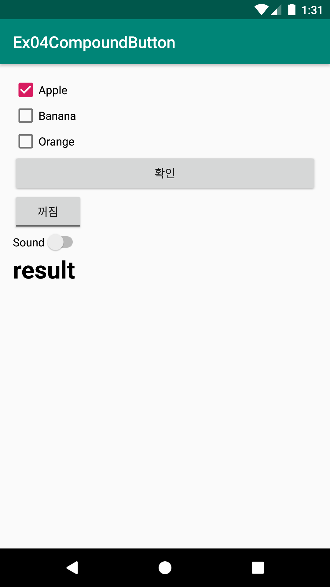
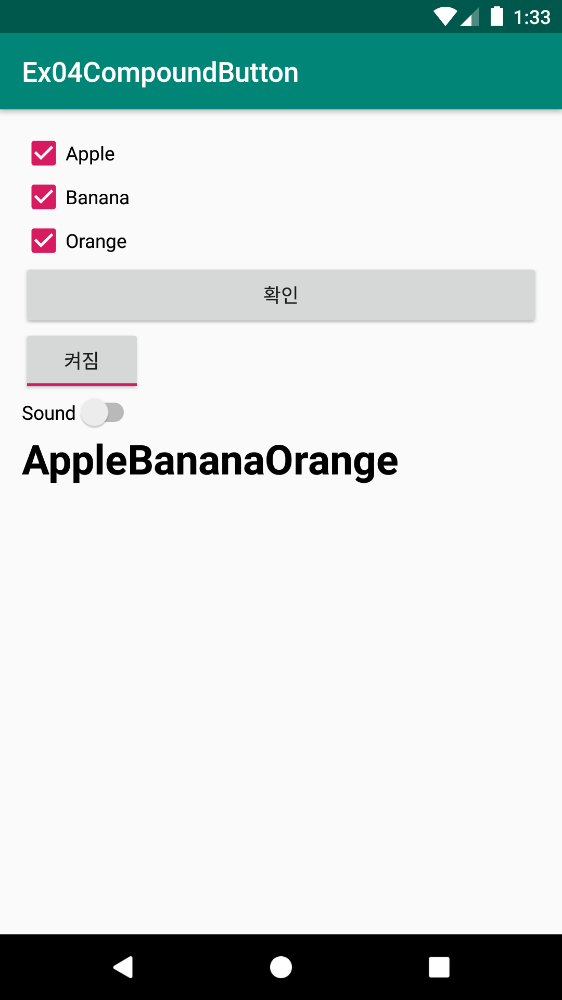
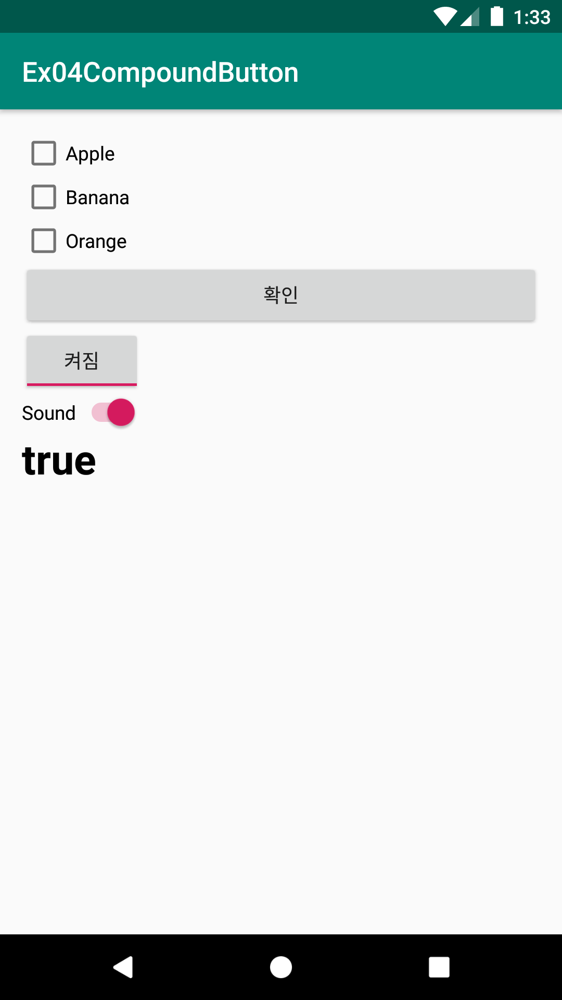

# Ex04CompoundButton
안드로이드 네이티브 앱 개발 수업 예제#4

# 주요코드
ChecxBox, ToggleButton, Switch, RadioButton같은 CompoundButton(복합버튼) 알아보기

- res폴더>>layout폴더안에 있는 activity_main.xml문서를 수정하여 화면제작
- CheckBox 3개와 Button 1개, TextView 1개를 만들어 버튼이 클릭되었을 때 선택(Selected)되어 있는 CheckBox들의 텍스트를 얻어와 TextView에 표시하기
- CheckBox 버튼의 선택(Selected)상태가 변경될 때마다 선택된 체크박스의 텍스트를 표시하기 - 선택상태 변경 리스너 객체 OnCheckedChangeListener 소개
- ToggleButton의 선택변화리스너 OnCheckedChangeListener를 통해 On/OFF상태 반응하기
- Switch 위젯의 사용법은 ToggleButton과 같음. 보여지는 UI모양만 다름. 요즘은 switch 뷰가 더 많이 선호됨

# 실행모습

  
  
  

# 실행모습 GIF

  

